<div align="center">


# Screen2ipcam

### Your Windows screen. Your IP camera.

Turn any Windows PC **screen** into a standard **ONVIF / RTSP IP camera** —<br>
record it in any **NVR or VMS**, with **no capture card** and **no hardware encoder**.

<br>

&nbsp;
&nbsp;


<a href="https://apps.microsoft.com/detail/9pjdgr30l9l1"></a>&nbsp;
<a href="https://sourceforge.net/projects/screen2ipcam/files/latest/download"></a>&nbsp;
&nbsp;
&nbsp;
<a href="https://www.softpedia.com/get/Internet/Streaming/Screen2ipcam.shtml"></a>

<br>

[**⬇️ Download**](#download) &nbsp;·&nbsp; [**✨ Features**](#features) &nbsp;·&nbsp; [**🔌 How it works**](#how) &nbsp;·&nbsp; [**🖼️ Screenshots**](#shots) &nbsp;·&nbsp; [**💲 Pricing**](#pricing) &nbsp;·&nbsp; [**⭐ Review**](#review) &nbsp;·&nbsp; [**💬 Comments**](#comments)

<br>

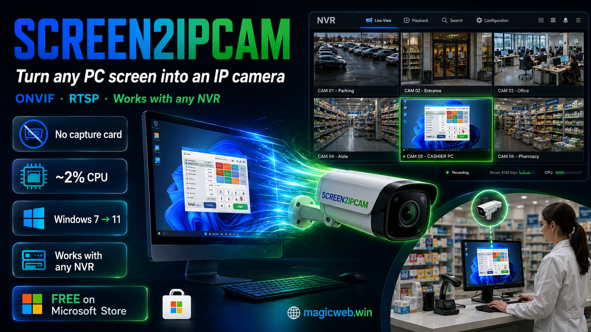

<i>A Windows PC screen — live in your NVR, right next to your real cameras.</i>

<br><br>

<a href="https://apps.microsoft.com/detail/9pjdgr30l9l1?src=github"></a>
&nbsp;&nbsp;
<a href="https://sourceforge.net/projects/screen2ipcam/files/latest/download"></a>

🌐 Official site — **[magicweb.win](https://magicweb.win/?src=github)**

</div>

<br>

## 🎯 What is Screen2ipcam?

Screen2ipcam runs on a Windows PC and publishes its **screen** as a standard **ONVIF Profile S** camera with an **H.264 RTSP** stream (main + sub). Your NVR or VMS — **Dahua, Hikvision, Milestone, Genetec, Nx Witness, Blue Iris** — discovers it like any other IP camera and records it. No HDMI encoder, no capture hardware, no extra PC.

### 🤝 Works with

<div align="center">

&nbsp;
&nbsp;
&nbsp;


&nbsp;
&nbsp;
&nbsp;
&nbsp;
&nbsp;


<sub>…and any other NVR / VMS / player that speaks standard <b>ONVIF</b> or <b>RTSP</b>.</sub>

</div>

Anywhere you'd like a screen visible inside your existing surveillance system:

| | | |
|---|---|---|
| 🧾 **POS & cashier systems** | 🏫 **Schools & training labs** | 🏭 **Factories — SCADA / HMI** |
| 🚚 **Warehouses & logistics** | 🏥 **Healthcare & lab equipment** | 🎓 **Examination centers** |
| 📊 **Dashboards & control rooms** | 🖥️ **Remote branches & kiosks** | 📺 **Digital signage** |

> Used responsibly and lawfully — see the License Agreement. The operator is solely responsible for obtaining any required consents.

<br>

<a id="whats-new"></a>
## 🆕 New in 2.0.1

<table>
<tr><td width="55%" valign="top">

**🔊 Sound, not just picture**<br>
The PC's own audio now travels inside the same stream using the standard
**G.711** codec, so your recorder stores sound and video together on one
timeline. Off by default, and it only runs while somebody is watching.

**🏷️ Camera name and time on the image**<br>
Burn the camera name and the date & time into the picture — pick the corner,
colour, size and opacity for each, independently.

**🔴 Privacy alert**<br>
An optional badge on the streaming PC's own screen while a viewer is
connected, so the person at the machine knows.

**👁️ Connected devices**<br>
See which recorders are pulling the stream right now, their addresses,
and for how long.

**➕ Also in this release**<br>
Wider recorder compatibility (the sub/SD stream now works on every recorder
we tested) · fixed the picture being cut off at 125% / 150% display scaling ·
the picture follows a resolution change automatically · separate **Save** and
**Apply** buttons · a confirmation before the camera is closed.

📄 **[Full release notes →](https://magicweb.win/updates.html?src=github)**

</td><td width="45%" valign="top">

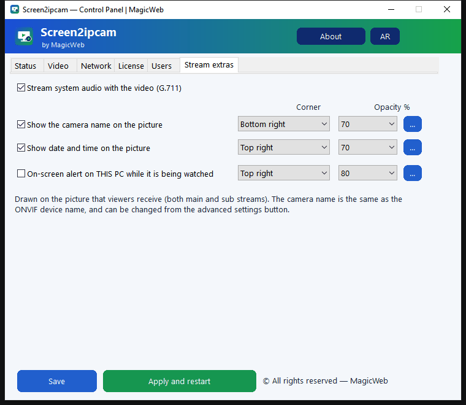
<sub>The new <b>Stream extras</b> tab</sub>

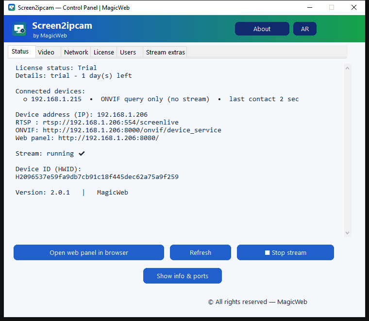
<sub><b>Connected devices</b> on the Status tab</sub>

</td></tr>
</table>

<div align="center">
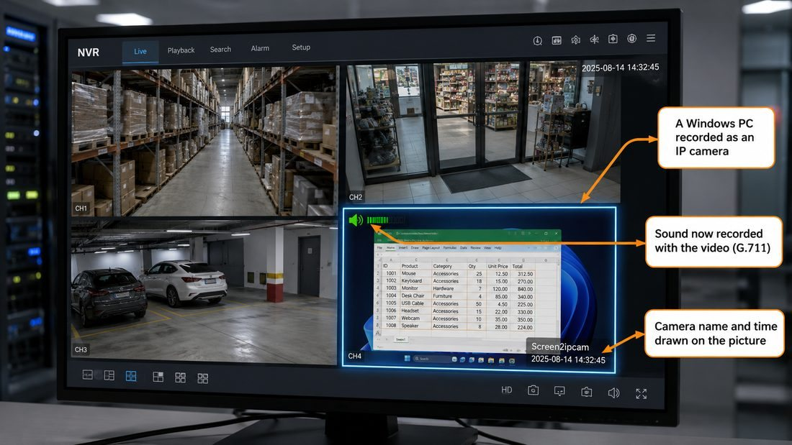
<br><sub>Illustration — how it appears on a recorder</sub>
</div>

<br>

<a id="download"></a>
## ⬇️ Download — free 14-day trial

**Easiest, zero-warning install** — the free edition on the **Microsoft Store** is signed by Microsoft, so there's no SmartScreen/Defender warning:

<div align="center">

<a href="https://apps.microsoft.com/detail/9pjdgr30l9l1?src=github"></a>

</div>

**Or grab the installer directly:**

| | Download | Notes |
|---|---|---|
| 🌐 | **[magicweb.win](https://magicweb.win/?src=github#download)** | Official site — all download options |
| 💾 | [Screen2ipcam Setup — **x64**](https://magicweb.win/downloads/Screen2ipcam_Setup_x64.exe?src=github) | 64-bit — modern PCs |
| 🖥️ | [Screen2ipcam Setup — **x86**](https://magicweb.win/downloads/Screen2ipcam_Setup_x86.exe?src=github) | 32-bit — older / embedded / POS |
| 📘 | [User guide — English (PDF)](https://magicweb.win/downloads/Screen2ipcam_Guide_EN.pdf?src=github) | Ports, NVR setup, Dahua & Hikvision |
| 📗 | [دليل الاستخدام — عربي (PDF)](https://magicweb.win/downloads/Screen2ipcam_Guide_AR.pdf?src=github) | الدليل الكامل بالعربية |

The trial is **14 days, fully functional**. A one-time license unlocks the full version — **no watermark, no time limit**.

<br>

<a id="features"></a>
## ✨ Features

| | |
|---|---|
| 📡 **ONVIF Profile S** | Auto-discovered by NVRs (WS-Discovery), or add by IP |
| 🎬 **RTSP H.264** | **Main + Sub** streams — perfect for NVR grid views |
| 🖥️ **Live screen capture** | The full primary screen, exactly as the operator sees it |
| 📸 **JPEG snapshot** | Standard `GetSnapshotUri` support |
| 🔊 **Audio (G.711)** | Streams the PC's own sound with the video — recorded by the NVR |
| 🏷️ **On-screen extras** | Camera name and date/time drawn on the picture, your choice of corner |
| 👁️ **Connected devices** | See who is watching right now, from where, and for how long |
| 🪶 **Featherweight** | ~0% CPU idle · ~2% while streaming · ~60 MB RAM |
| ⚙️ **Native C++** | Static runtime — no .NET, no redistributables |
| 🪟 **Windows 7 SP1 → 11** | 32-bit & 64-bit — IoT / Embedded / POSReady too |
| 🛠️ **Always-on** | Installs as a Windows Service, or runs as a tray app |
| 🎛️ **3 ways to configure** | Native GUI · web panel · config file |
| 🔒 **Stream security** | Optional ONVIF / RTSP authentication (Digest / WS-Security) |
| 🌍 **Bilingual UI** | English / العربية |

<br>

<a id="how"></a>
## 🔌 How it works

```
PC screen  →  H.264 encode  →  ONVIF / RTSP  →  your NVR / VMS
```

<div align="center">

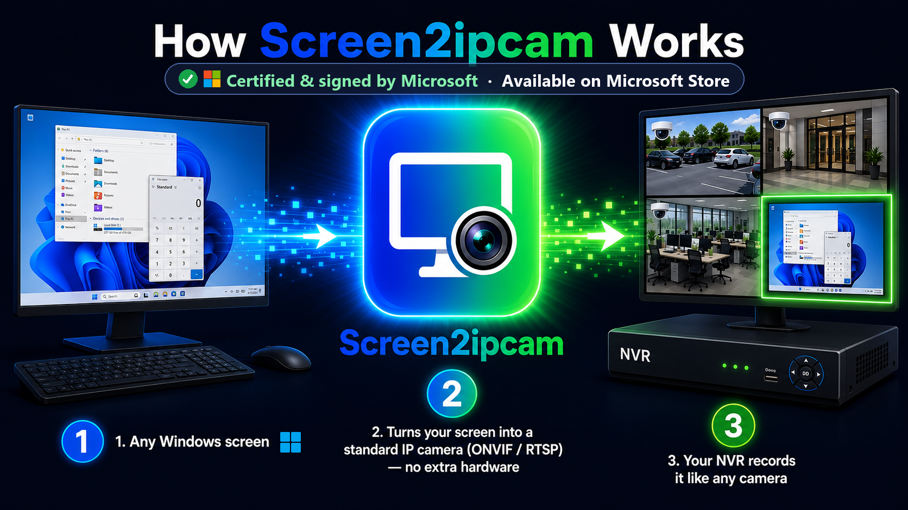

</div>

**Ports**

| Port | Protocol | Purpose |
|:---:|:---:|---|
| `554` | TCP | RTSP stream |
| `8000` | TCP | ONVIF service |
| `8080` | TCP | Web admin panel *(not needed by the NVR)* |
| `3702` | UDP | WS-Discovery *(optional — you can add by IP instead)* |

For a segmented camera VLAN, the NVR only needs to reach the PC on **554** and **8000**.

### 🚀 Quick start — 3 steps

1. **Install** from the [Microsoft Store](https://apps.microsoft.com/detail/9pjdgr30l9l1?src=github) (signed) or [download](#download) the installer.
2. **Open the control panel** — default login `admin` / `admin`.
3. **On your NVR:** Add Camera → **ONVIF** (auto-discover, or enter the PC's IP + port `8000`). Done — it records like any camera.

<br>

<a id="shots"></a>
## 🖼️ See it in action

<div align="center">

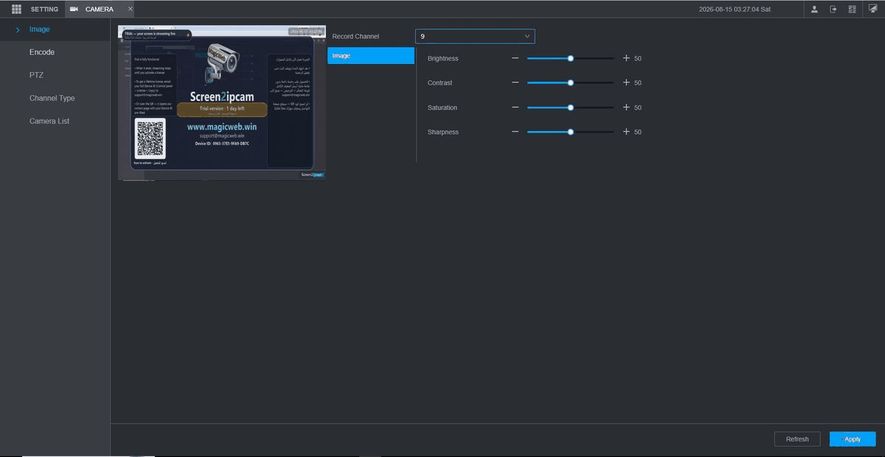
<br><sub>A real Dahua NVR playing the PC screen as an ordinary camera channel</sub>

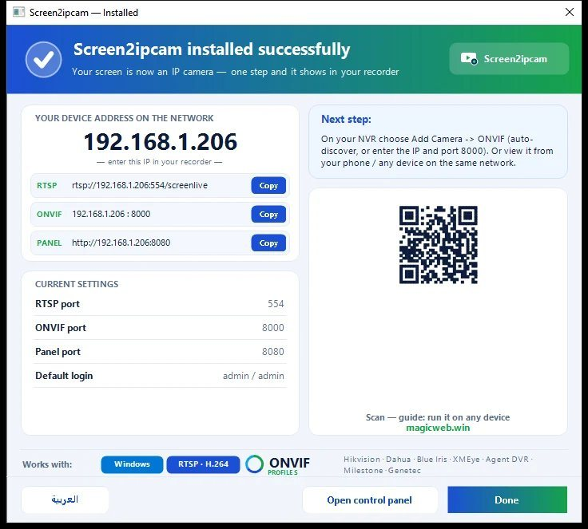
<br><sub>Right after install — the address, links and ports, each with a Copy button</sub>

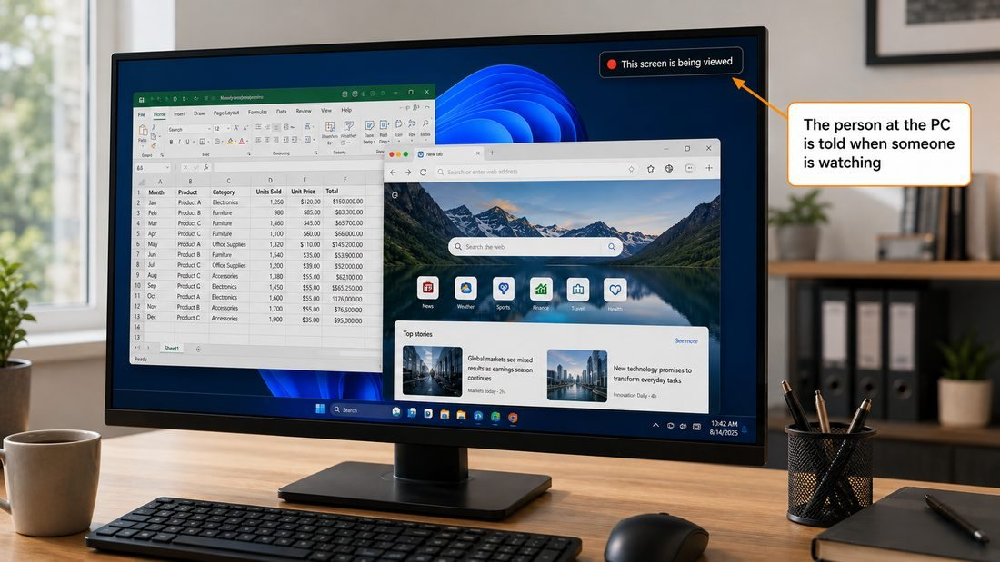
<br><sub>Illustration — the optional privacy alert, shown only on the streaming PC</sub>


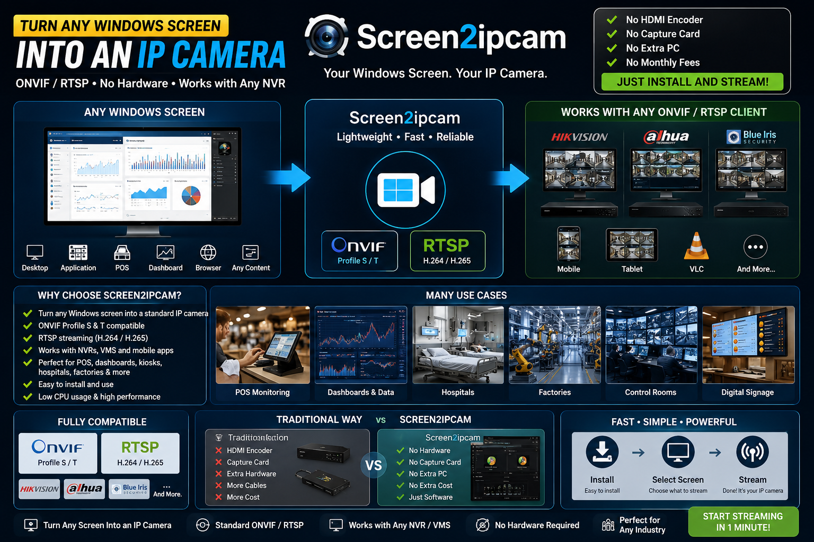

<br><br>

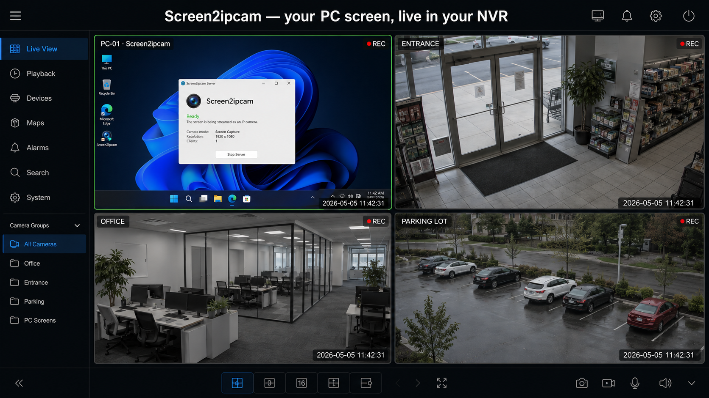

<br><br>

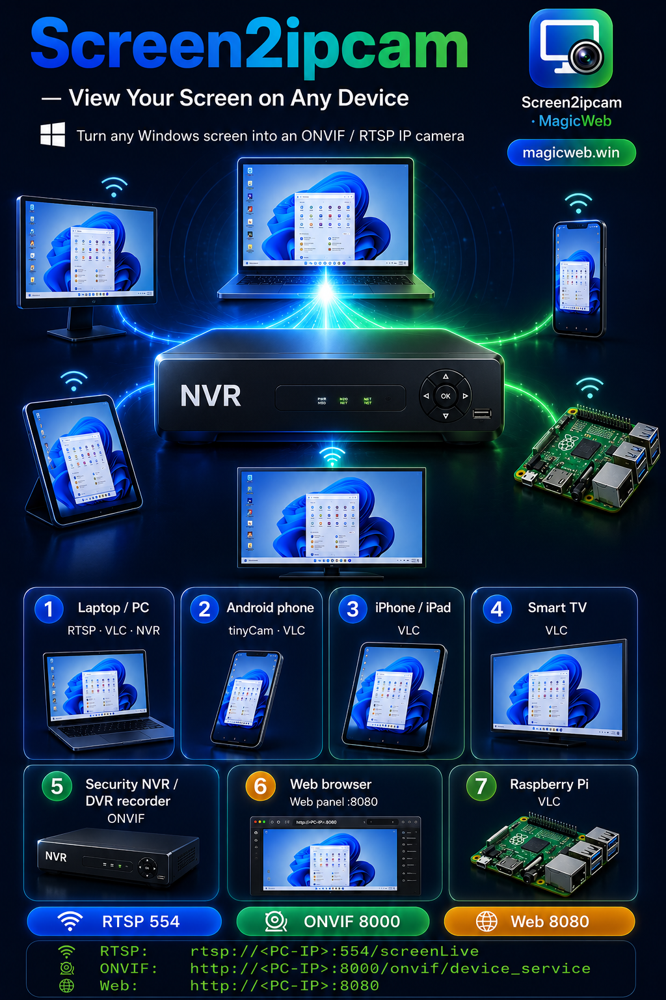

</div>

<details>
<summary><b>🖥️ Web control panel</b> — browser-based admin at <code>http://[device-ip]:8080</code> <i>(click to expand)</i></summary>
<br>

**System / License** — device ID, license status, and activation QR
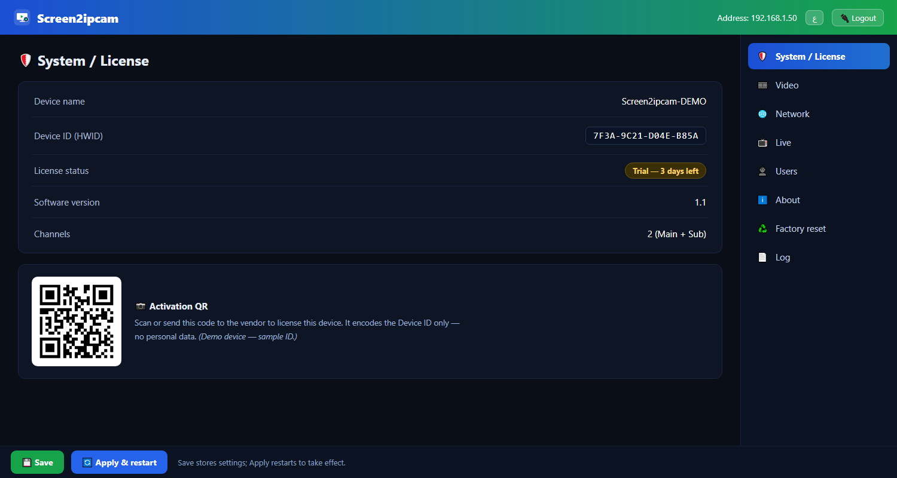

**Network** — ports & optional stream authentication


</details>

<details>
<summary><b>🪟 Windows control panel</b> — native desktop app + service installer <i>(click to expand)</i></summary>
<br>

**Desktop control panel** — stream settings, tray icon, and service status
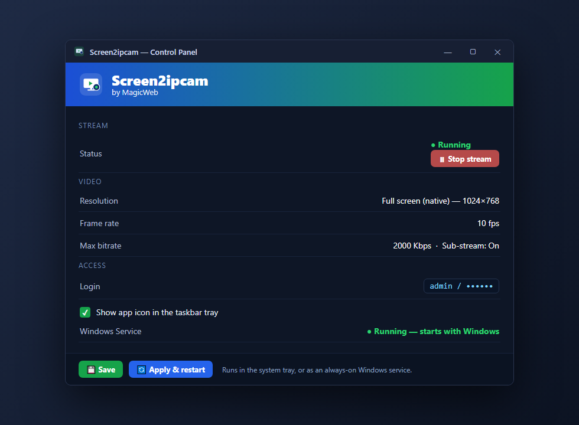

**Installer** — desktop shortcut, run at startup, and install as a Windows service
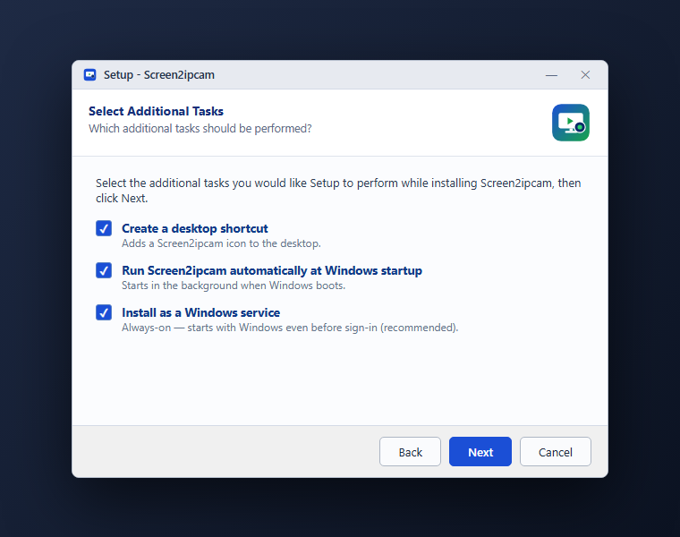

</details>

<br>

<a id="pricing"></a>
## 💲 Pricing

| | Free trial | Lifetime license |
|---|:---:|:---:|
| **Price** | **$0** | **$20** — one-time |
| Every feature unlocked | ✅ | ✅ |
| Duration | 14 days | **Forever** |
| Watermark after trial | — | **Never** |
| Activations | — | 1 PC (locked to its Device ID) |

<div align="center">

**[Get your license at magicweb.win →](https://magicweb.win/?src=github#pricing)**

</div>

<br>

<a id="review"></a>
## ⭐ Reviewed by Softpedia

<div align="center">

<a href="https://www.softpedia.com/get/Internet/Streaming/Screen2ipcam.shtml"></a>&nbsp;


</div>

> **"Screen2ipcam essentially turns your computer into an IP camera."** Your computer is then recognized as such by your NVR, enabling you to monitor your security footage and computer screen from the same place, with the program facilitating this workflow through a straightforward setup process.
>
> **Stream your screen like an IP camera** — "Although turning your computer screen into an IP camera sounds like a complicated thing to do, that's not the case here. The software makes the whole process easy to go through, so you should be able to stream your screen within minutes of setting up the app. The connection to your surveillance device is handled via ONVIF … you can always input the RTSP address into VLC or a compatible player to check if the stream is active."
>
> **Comes with several options for customization** — "The program uses H.264 as the main codec, with options for tweaking resolution, frame rate, and bit rate … you can also opt for different RTSP and ONVIF ports from the app or web portal."
>
> — **Robert Condorache** · [Full review on Softpedia](https://www.softpedia.com/get/Internet/Streaming/Screen2ipcam.shtml) · rated **5.0 / 5** · **Certified 100% Clean**

<details>
<summary><b>📷 Screenshots from the Softpedia review</b> <i>(click to expand)</i></summary>
<br>

|  |  |  |
|:--:|:--:|:--:|
| 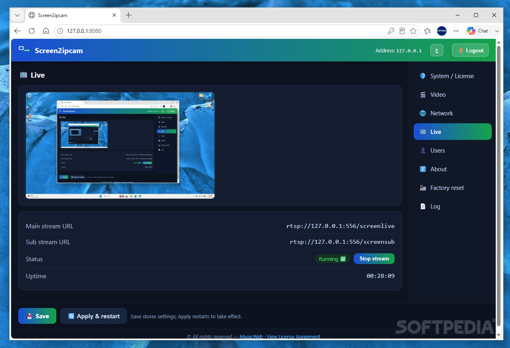 | 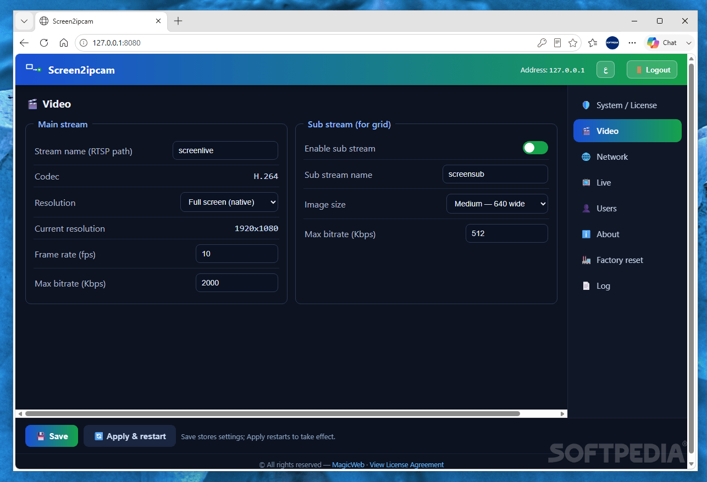 | 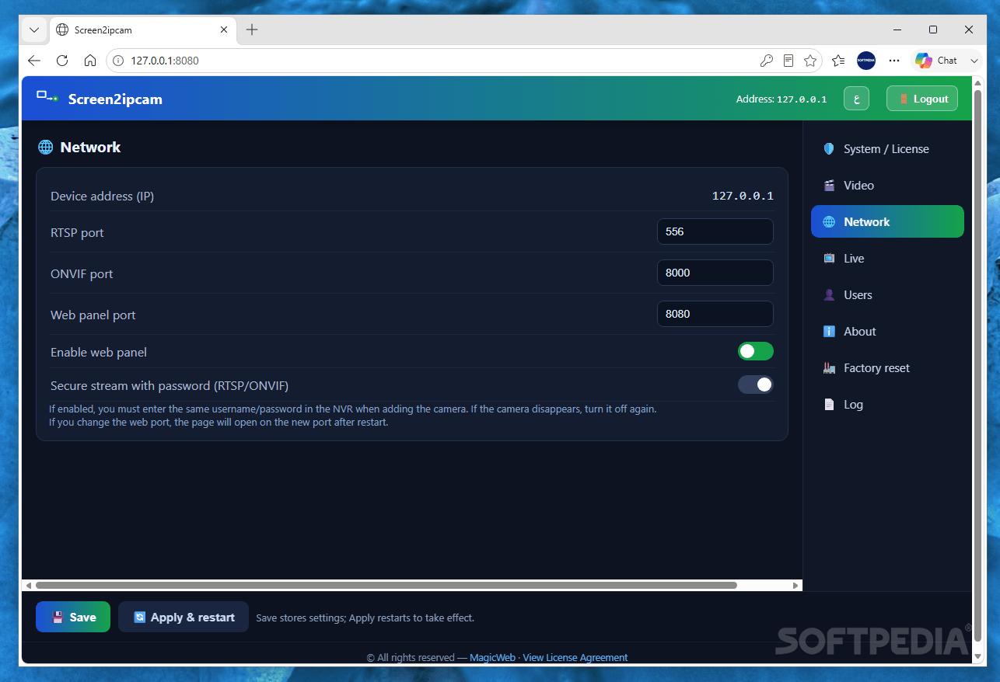 |
| **Web panel · Live** | **Web panel · Video** | **Web panel · Network** |
| 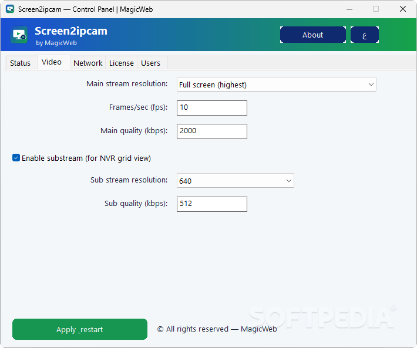 | 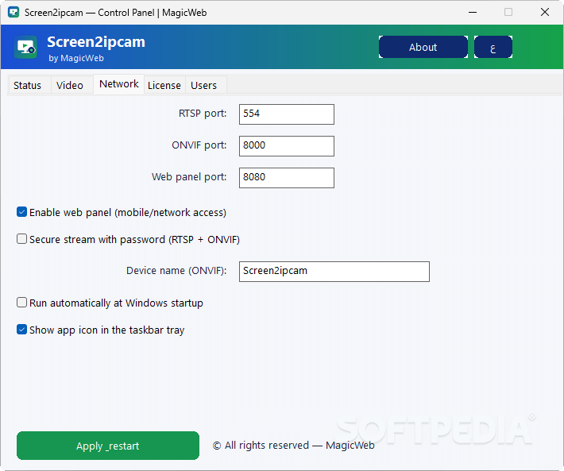 | 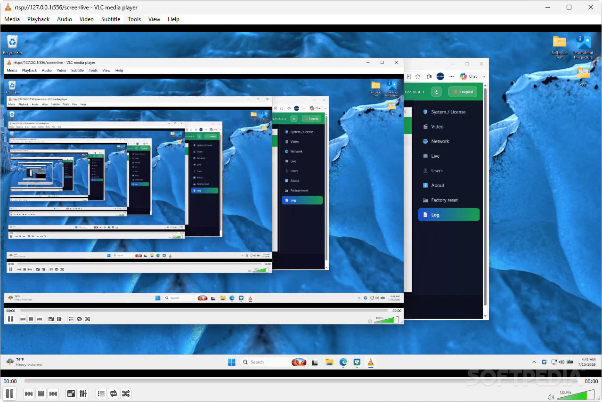 |
| **Desktop app · Video** | **Desktop app · Network** | **Verified in VLC (RTSP)** |

</details>

### 📚 Also listed on

[Softpedia](https://www.softpedia.com/get/Internet/Streaming/Screen2ipcam.shtml) · [Soft112](https://screen2ipcam.soft112.com/) · [Software Informer](https://screen2ipcam.software.informer.com/)

<br>

## ❓ FAQ

<details>
<summary><b>Which NVRs and software does it work with?</b></summary>
<br>

Any system that supports **ONVIF** or **RTSP**. Tested with **Dahua**, **Hikvision**, **Blue Iris** and **Agent DVR**; standard ONVIF/RTSP means enterprise VMS platforms (Milestone, Genetec, Nx Witness…) ingest it too.
</details>

<details>
<summary><b>How long is the trial?</b></summary>
<br>

**14 days, fully functional.** A license unlocks the full version — no watermark and no time limit.
</details>

<details>
<summary><b>Does it record sound?</b></summary>

Yes, since **2.0.1**. It sends what the PC plays (not a microphone) inside the same
stream using **G.711**. It is off by default, and even when enabled it only runs while
a viewer is connected.

</details>

<details>
<summary><b>The recorder shows no sound — what do I set?</b></summary>

On the recorder's channel settings choose audio compression **G.711Mu** (also written
G.711 µ-law) and audio source **Local** — G.711A, PCM and AAC will not play.
And if the channel was added to the recorder **before** you switched audio on, remove
the channel and add it again: the recorder reads the camera's capabilities once, when
the channel is created. That is the most common cause of silent audio.

</details>

<details>
<summary><b>Which Windows versions are supported?</b></summary>
<br>

**Windows 7 SP1 through Windows 11**, both 32-bit and 64-bit — including Windows IoT / Embedded / POSReady. No .NET or extra runtimes needed.
</details>

<details>
<summary><b>Why does Windows warn about the direct installer?</b></summary>
<br>

The direct EXE is native and not code-signed yet, so SmartScreen may flag it as unknown (a false positive — it's safe to keep). For a **zero-warning install**, use the **[Microsoft Store edition](https://apps.microsoft.com/detail/9pjdgr30l9l1?src=github)**, which is signed by Microsoft.
</details>

<details>
<summary><b>How do I get my license after paying?</b></summary>
<br>

Send your **Device ID** (from the app's License tab) via the [contact form](https://magicweb.win/?src=github#contact) or email. We generate and send your license file, usually within hours. Each license activates **one PC**, locked to its Device ID.
</details>

<details>
<summary><b>How do I uninstall it?</b></summary>
<br>

**Settings → Apps**, or the **Uninstall Screen2ipcam** shortcut. It asks for the program password (default `admin` / `admin`) — so a casual user can't remove it from a deployed PC. Forgot the password? Click **Forgot password?** on the web-panel login and email the Device ID to **support@magicweb.win** for a reset code.
</details>

<br>

<a id="comments"></a>
## 💬 Comments & feedback

Your feedback shapes the roadmap — questions, ideas, setup stories, NVR compatibility reports… everything is welcome:

| | Where | For |
|---|---|---|
| 💬 | **[Discussions →](https://github.com/elpasha3000/Screen2ipcam/discussions)** | Comments, questions, ideas, show & tell |
| 🐞 | **[Issues →](https://github.com/elpasha3000/Screen2ipcam/issues)** | Bug reports — something didn't work |
| 📧 | **[support@magicweb.win](mailto:support@magicweb.win)** | Direct support & licensing |

Especially useful to us: your **NVR / VMS model**, **ONVIF discovery result**, and **streaming performance / CPU usage**.

<br>

---

<div align="center">


**Screen2ipcam** — Your Windows screen. Your IP camera.

🌐 **[magicweb.win](https://magicweb.win/?src=github)** &nbsp;·&nbsp; 📧 **[support@magicweb.win](mailto:support@magicweb.win)** &nbsp;·&nbsp; 🏬 **[Microsoft Store](https://apps.microsoft.com/detail/9pjdgr30l9l1?src=github)**

⭐ *If Screen2ipcam is useful to you, a star helps others find it.*

<sub>© MagicWeb — All rights reserved.</sub>

</div>
